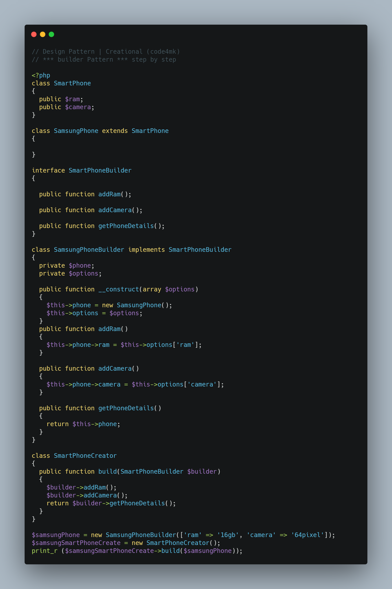

* create a complex object step by step.

```php
// Builder design pattern                                                            
// code4mk

class SmartPhone
{
  public $ram;
  public $camera;
}

class SamsungPhone extends SmartPhone
{

}

interface SmartPhoneBuilder
{

  public function addRam();

  public function addCamera();

  public function getPhoneDetails();
}

class SamsungPhoneBuilder implements SmartPhoneBuilder
{
  private $phone;
  private $options;

  public function __construct(array $options)
  {
    $this->phone = new SamsungPhone();
    $this->options = $options;
  }
  public function addRam()
  {
    $this->phone->ram = $this->options['ram'];
  }

  public function addCamera()
  {
    $this->phone->camera = $this->options['camera'];
  }

  public function getPhoneDetails()
  {
    return $this->phone;
  }
}

class SmartPhoneCreator
{
  public function build(SmartPhoneBuilder $builder)
  {
    $builder->addRam();
    $builder->addCamera();
    return $builder->getPhoneDetails();
  }
}

$samsungPhone = new SamsungPhoneBuilder(['ram' => '16gb', 'camera' => '64pixel']);
$samsungSmartPhoneCreate = new SmartPhoneCreator();
print_r ($samsungSmartPhoneCreate->build($samsungPhone));
```

# image




# resources

* https://designpatternsphp.readthedocs.io/en/latest/Creational/Builder/README.html
*  https://refactoring.guru/design-patterns/builder
* https://gist.github.com/aliselcuk/59e702e55d26de15c7fa2ef7907373c2
* https://gist.github.com/firefoxrebo/f78ab3c352b77279c94e208570eaf187
