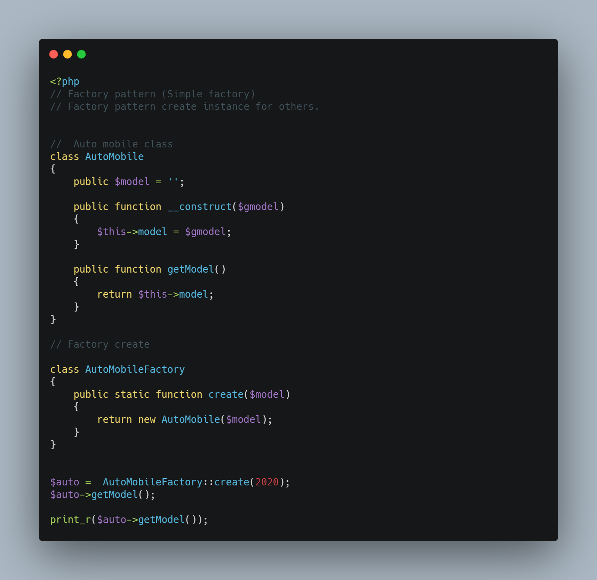

# Factory pattern

Factory pattern create instance for others.

Factory design pattern works like a factory in the real world in that it creates something for others to use. In the context of OOP, it helps in creating and instantiating objects.

# Factory type

* simple factory
* abtract factory
* factory method

# simple factory



# factory method

```php
class DBFactory
{
  private $driver;

  public function setDriver($driver)
  {
    $this->driver = $driver
  }

  public function makeDB($host, $dbname, $user, $pass)
  {
     $db;
    if ($this->driver == 'mysql') {
      $db = new Mysql();
    }elseif ($this->driver == 'postgre') {
      $db = new Postgre();
    }else{
      $db = new Sqlite();
    }

    $db->setHost($host);
    $db->setDB($dbname);
    $db->setUserName($user);
    $db->setPassword($pass);
    $db->connect();

    return $db;
  }
}

$dbFactory = new DBFactory;
$dbFactory->setDriver('mysql'));
$DB = $dbFactory->makeDB("host", "db", "user", "pwd");
```
# Abstract factory

```php
abstract class Employee
{
  abstract public function info();

  public function getName()
  {
    return 'name: ' .  $this->info()->name();
  }
}

class HrInfo
{
  public function name()
  {
    return 'kamal';
  }
}

class Hr extends Employee
{
  public function info()
  {
    return new HrInfo();
  }
}

$hr = new Hr();
print_r($hr->getName());
// kamal
```

# resources
* https://gist.github.com/oktapodi/6ea734dbb945b69f9fcc `simple factory`
* https://refactoring.guru/design-patterns/factory-method/php/example#example-1 `abstract`
* https://codeinphp.github.io/post/factory-design-pattern/ `factory method`
* https://github.com/domnikl/DesignPatternsPHP/tree/main/Creational/SimpleFactory
* https://webmobtuts.com/backend-development/creating-classes-with-php-factory-abstract-factory-simple-and-static-factory-patterns/
* https://stackoverflow.com/questions/4719822/factory-abstract-factory-confusion

* https://kousiknath.medium.com/design-patterns-different-approaches-to-use-factory-pattern-to-choose-objects-dynamically-at-run-71449bceecef ***
