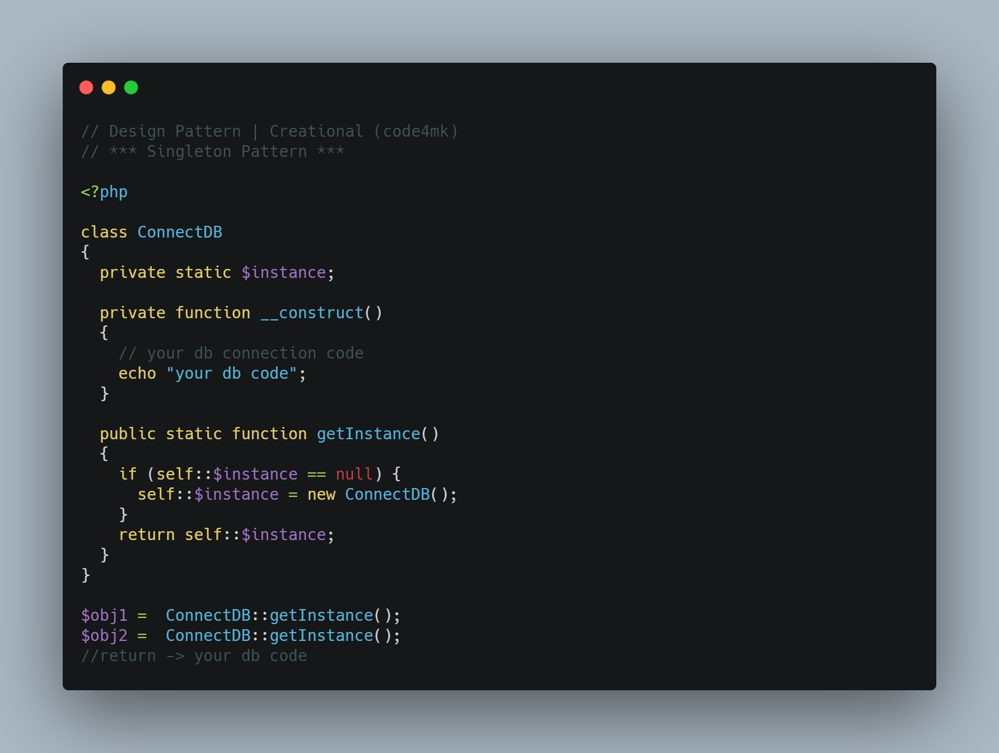

# Singleton Design pattern

Singleton design pattern create a single object of a class.


~

* class oriented not object oriented.
* create global state or variable.


1 . `It should have only one instance` : This is done by providing an instance of the class from within the class. Outer classes or subclasses should be prevented to create the instance. This is done by making the constructor private in java so that no class can access the constructor and hence cannot instantiate it.

2 . `Instance should be globally accessible` : Instance of singleton class should be globally accessible so that  each class can use it.


# Singleton Class Diagram

* `Static member` : This contains the instance of the singleton class.
* `Private constructor` : This will prevent anybody else to instantiate the Singleton class.
* `Static public method` : This provides the global point of access to the Singleton object and returns the instance to the client calling class.


```php
<?php
class ConnectDB
{
  private static $instance;

  private function __construct()
  {
    // your db connection code
    echo "your db code";
  }

  public static function getInstance()
  {
    if (self::$instance == null) {
      self::$instance = new ConnectDB();
    }
    return self::$instance;
  }
}
$obj1 =  ConnectDB::getInstance();
$obj2 =  ConnectDB::getInstance();
//return -> your db code
```

# when use singleton pattern

* hardware interface acccess
* db connection
* logger
* cache
* configure file

# image



# resources

* https://www.codeproject.com/Articles/852232/PHP-Singleton-Pattern-A-Step-by-Step-And-Problem-s
* https://www.youtube.com/watch?v=qWaFiOGwU-8
* https://www.geeksforgeeks.org/singleton-design-pattern-introduction/#:~:text=It%20is%20used%20where%20only,and%20thread%20pool%2C%20database%20connections.
* [laravel framework container](https://github.com/laravel/framework/blob/8.x/src/Illuminate/Container/Container.php#L1315)
* https://dzone.com/articles/singleton-anti-pattern
* https://phpenthusiast.com/blog/the-singleton-design-pattern-in-php
